# Siftera - Application Flows Documentation

## Table of Contents
1. [System Architecture Overview](#system-architecture-overview)
2. [Authentication Flow](#authentication-flow)
3. [User Journey Flow](#user-journey-flow)
4. [Resume Screening Flow](#resume-screening-flow)
5. [Admin Management Flow](#admin-management-flow)
6. [Gamification Flow](#gamification-flow)
7. [AI Analysis Flow](#ai-analysis-flow)
8. [Real-time Updates Flow](#real-time-updates-flow)

---

## System Architecture Overview

```
┌─────────────────┐    ┌─────────────────┐    ┌─────────────────┐
│   Frontend      │    │   Supabase      │    │   Edge          │
│   (React/Vite)  │◄──►│   Database      │◄──►│   Functions     │
│                 │    │   Auth/Storage  │    │   (AI Analysis) │
└─────────────────┘    └─────────────────┘    └─────────────────┘
         │                       │
         │              ┌─────────────────┐
         └──────────────►│   Real-time     │
                        │   Subscriptions │
                        └─────────────────┘
```

---

## Authentication Flow

### 1. User Registration
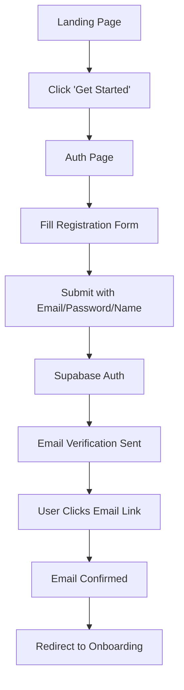
```mermaid
graph TD
    A[Landing Page] --> B[Click 'Get Started']
    B --> C[Auth Page]
    C --> D[Fill Registration Form]
    D --> E[Submit with Email/Password/Name]
    E --> F[Supabase Auth]
    F --> G[Email Verification Sent]
    G --> H[User Clicks Email Link]
    H --> I[Email Confirmed]
    I --> J[Redirect to Onboarding]
```

### 2. User Login
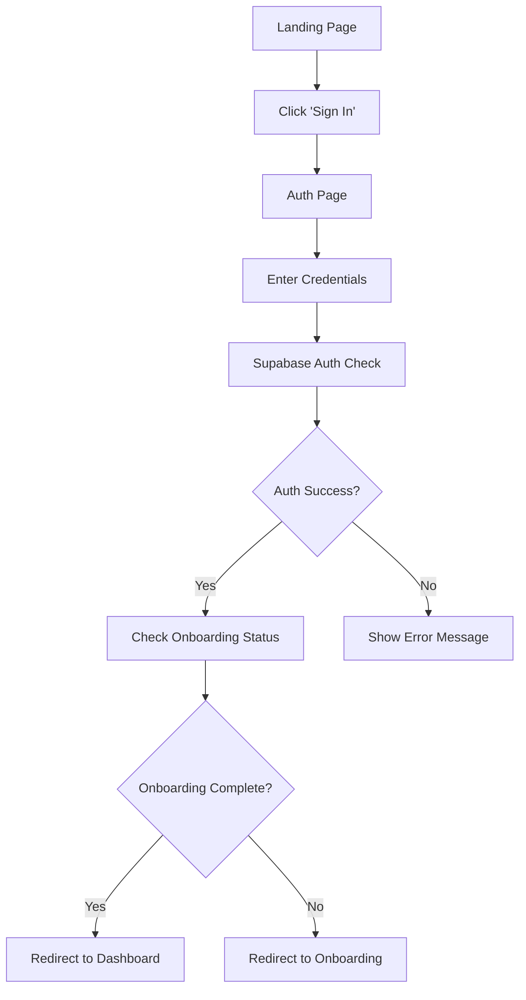
```mermaid
graph TD
    A[Landing Page] --> B[Click 'Sign In']
    B --> C[Auth Page]
    C --> D[Enter Credentials]
    D --> E[Supabase Auth Check]
    E --> F{Auth Success?}
    F -->|Yes| G[Check Onboarding Status]
    F -->|No| H[Show Error Message]
    G --> I{Onboarding Complete?}
    I -->|Yes| J[Redirect to Dashboard]
    I -->|No| K[Redirect to Onboarding]
```

### 3. Admin Access
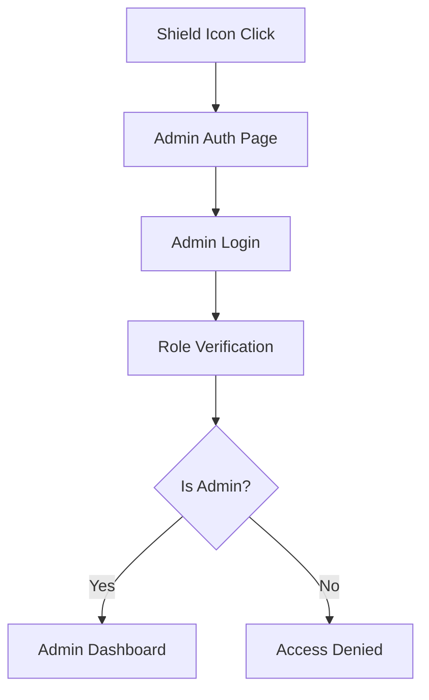
```mermaid
graph TD
    A[Shield Icon Click] --> B[Admin Auth Page]
    B --> C[Admin Login]
    C --> D[Role Verification]
    D --> E{Is Admin?}
    E -->|Yes| F[Admin Dashboard]
    E -->|No| G[Access Denied]
```

---

## User Journey Flow

### Complete User Onboarding
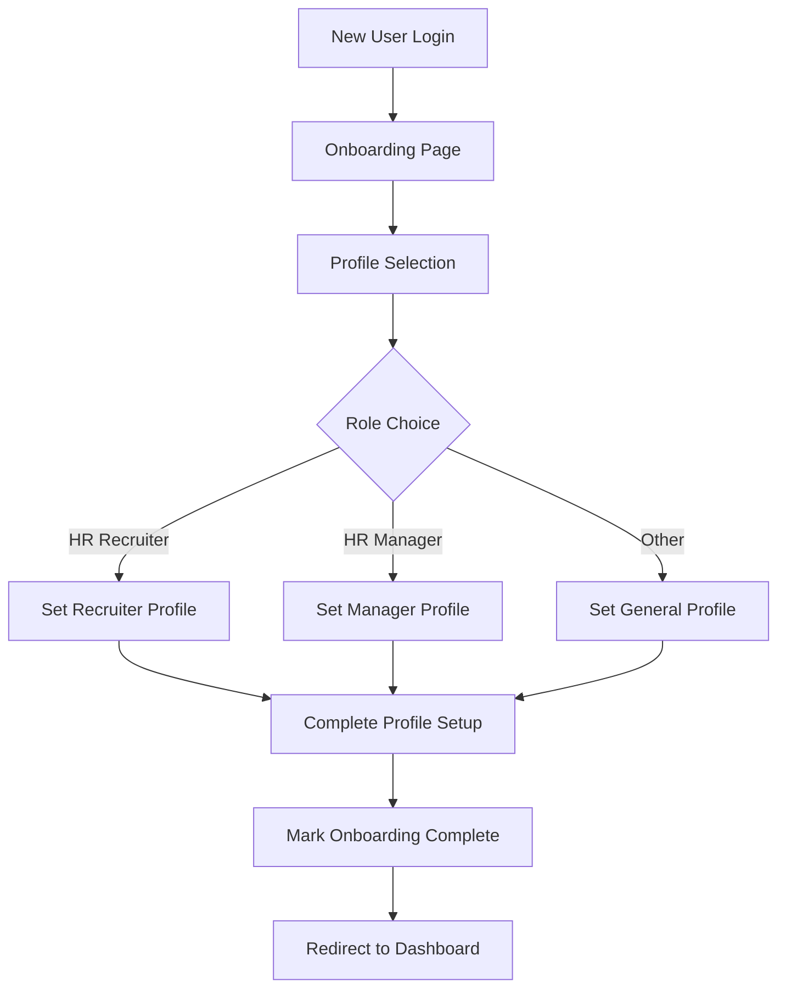
```mermaid
graph TD
    A[New User Login] --> B[Onboarding Page]
    B --> C[Profile Selection]
    C --> D{Role Choice}
    D -->|HR Recruiter| E[Set Recruiter Profile]
    D -->|HR Manager| F[Set Manager Profile]
    D -->|Other| G[Set General Profile]
    E --> H[Complete Profile Setup]
    F --> H
    G --> H
    H --> I[Mark Onboarding Complete]
    I --> J[Redirect to Dashboard]
```

### Dashboard Navigation
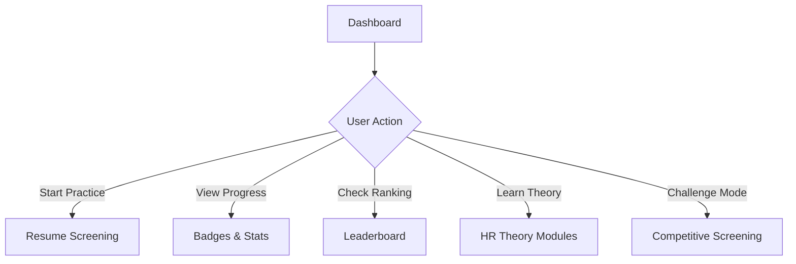
```mermaid
graph TD
    A[Dashboard] --> B{User Action}
    B -->|Start Practice| C[Resume Screening]
    B -->|View Progress| D[Badges & Stats]
    B -->|Check Ranking| E[Leaderboard]
    B -->|Learn Theory| F[HR Theory Modules]
    B -->|Challenge Mode| G[Competitive Screening]
```

---

## Resume Screening Flow

### Standard Screening Process
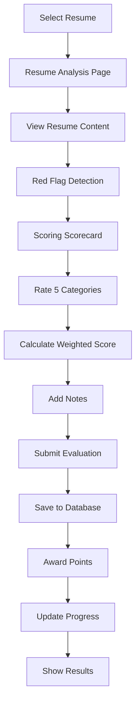
```mermaid
graph TD
    A[Select Resume] --> B[Resume Analysis Page]
    B --> C[View Resume Content]
    C --> D[Red Flag Detection]
    D --> E[Scoring Scorecard]
    E --> F[Rate 5 Categories]
    F --> G[Calculate Weighted Score]
    G --> H[Add Notes]
    H --> I[Submit Evaluation]
    I --> J[Save to Database]
    J --> K[Award Points]
    K --> L[Update Progress]
    L --> M[Show Results]
```

### Scoring Categories & Weights
```
┌─────────────────────────┬────────┬─────────┐
│ Category                │ Weight │ Max Pts │
├─────────────────────────┼────────┼─────────┤
│ Relevant Experience     │  30%   │   30    │
│ Skills & Certifications │  25%   │   25    │
│ Career Progression      │  20%   │   20    │
│ Achievements           │  15%   │   15    │
│ Communication Clarity   │  10%   │   10    │
└─────────────────────────┴────────┴─────────┘
Total Possible Score: 100 points
```

### Red Flag Detection
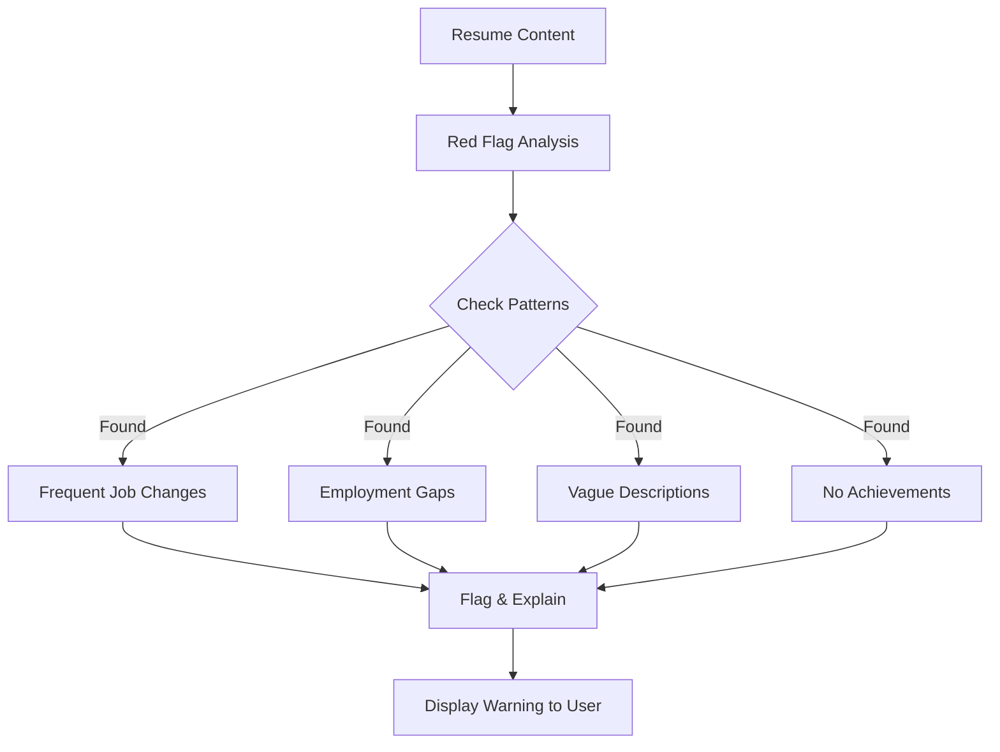
```mermaid
graph TD
    A[Resume Content] --> B[Red Flag Analysis]
    B --> C{Check Patterns}
    C -->|Found| D[Frequent Job Changes]
    C -->|Found| E[Employment Gaps]
    C -->|Found| F[Vague Descriptions]
    C -->|Found| G[No Achievements]
    D --> H[Flag & Explain]
    E --> H
    F --> H
    G --> H
    H --> I[Display Warning to User]
```

---

## Admin Management Flow

### Resume Management
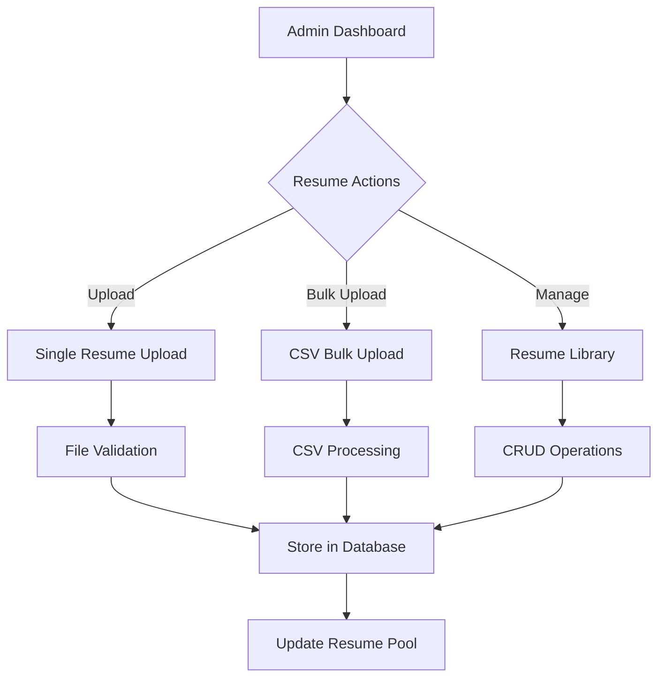
```mermaid
graph TD
    A[Admin Dashboard] --> B{Resume Actions}
    B -->|Upload| C[Single Resume Upload]
    B -->|Bulk Upload| D[CSV Bulk Upload]
    B -->|Manage| E[Resume Library]
    C --> F[File Validation]
    D --> G[CSV Processing]
    E --> H[CRUD Operations]
    F --> I[Store in Database]
    G --> I
    H --> I
    I --> J[Update Resume Pool]
```

### User Management
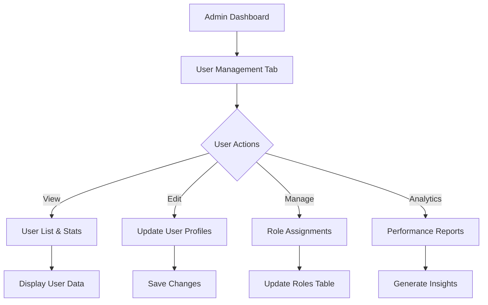
```mermaid
graph TD
    A[Admin Dashboard] --> B[User Management Tab]
    B --> C{User Actions}
    C -->|View| D[User List & Stats]
    C -->|Edit| E[Update User Profiles]
    C -->|Manage| F[Role Assignments]
    C -->|Analytics| G[Performance Reports]
    D --> H[Display User Data]
    E --> I[Save Changes]
    F --> J[Update Roles Table]
    G --> K[Generate Insights]
```

### AI Training Configuration
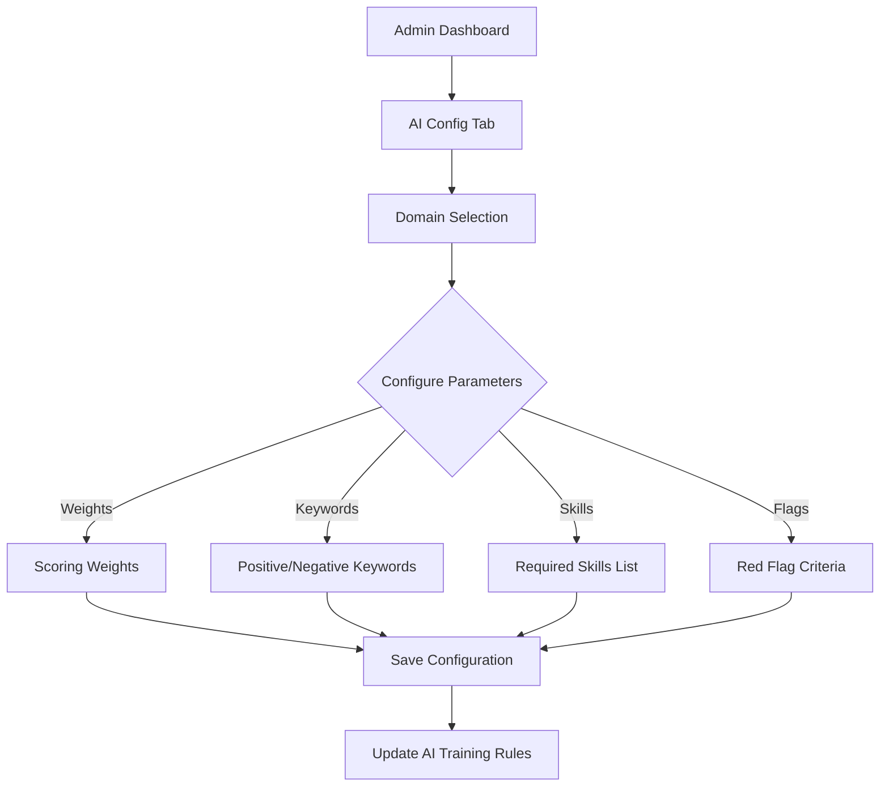
```mermaid
graph TD
    A[Admin Dashboard] --> B[AI Config Tab]
    B --> C[Domain Selection]
    C --> D{Configure Parameters}
    D -->|Weights| E[Scoring Weights]
    D -->|Keywords| F[Positive/Negative Keywords]
    D -->|Skills| G[Required Skills List]
    D -->|Flags| H[Red Flag Criteria]
    E --> I[Save Configuration]
    F --> I
    G --> I
    H --> I
    I --> J[Update AI Training Rules]
```

---

## Gamification Flow

### Points System
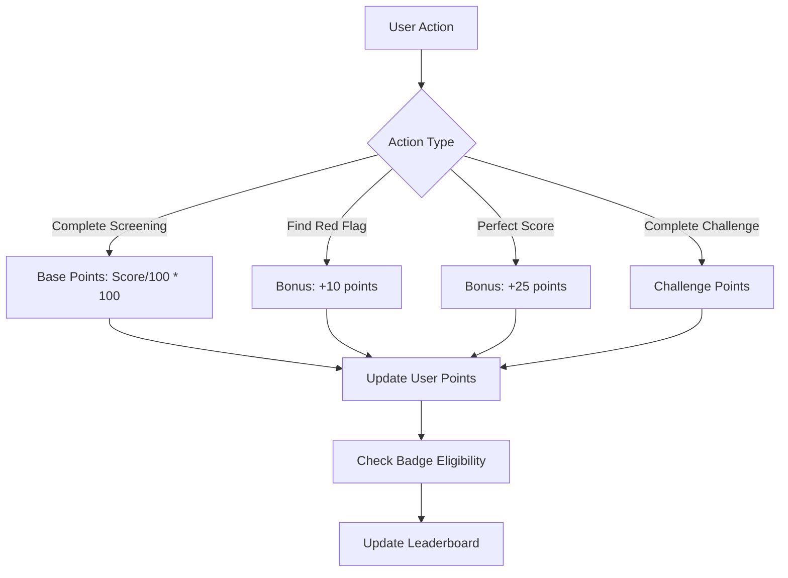
```mermaid
graph TD
    A[User Action] --> B{Action Type}
    B -->|Complete Screening| C[Base Points: Score/100 * 100]
    B -->|Find Red Flag| D[Bonus: +10 points]
    B -->|Perfect Score| E[Bonus: +25 points]
    B -->|Complete Challenge| F[Challenge Points]
    C --> G[Update User Points]
    D --> G
    E --> G
    F --> G
    G --> H[Check Badge Eligibility]
    H --> I[Update Leaderboard]
```

### Badge System
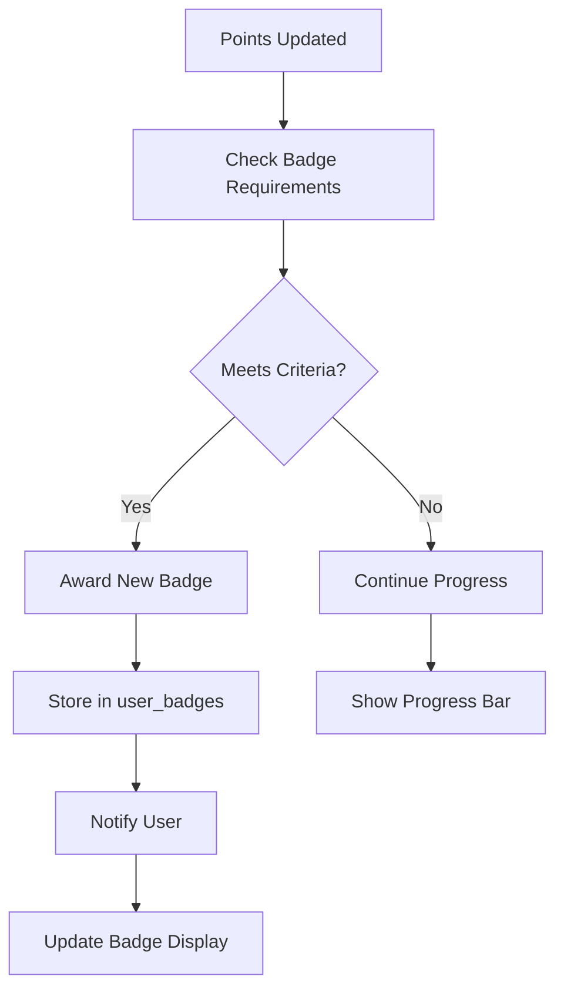
```mermaid
graph TD
    A[Points Updated] --> B[Check Badge Requirements]
    B --> C{Meets Criteria?}
    C -->|Yes| D[Award New Badge]
    C -->|No| E[Continue Progress]
    D --> F[Store in user_badges]
    F --> G[Notify User]
    G --> H[Update Badge Display]
    E --> I[Show Progress Bar]
```

### Leaderboard Updates
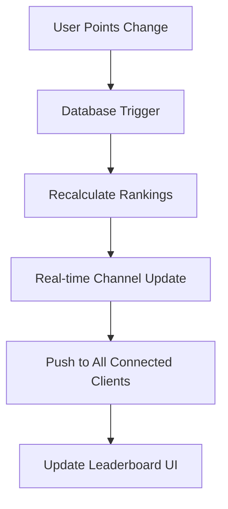
```mermaid
graph TD
    A[User Points Change] --> B[Database Trigger]
    B --> C[Recalculate Rankings]
    C --> D[Real-time Channel Update]
    D --> E[Push to All Connected Clients]
    E --> F[Update Leaderboard UI]
```

---

## AI Analysis Flow

### Resume Analysis Pipeline
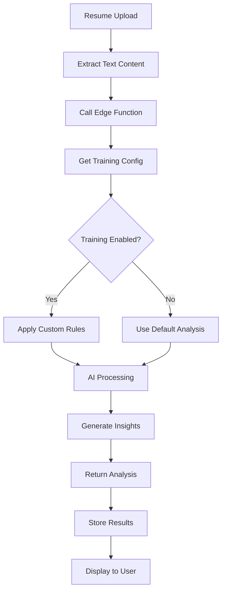
```mermaid
graph TD
    A[Resume Upload] --> B[Extract Text Content]
    B --> C[Call Edge Function]
    C --> D[Get Training Config]
    D --> E{Training Enabled?}
    E -->|Yes| F[Apply Custom Rules]
    E -->|No| G[Use Default Analysis]
    F --> H[AI Processing]
    G --> H
    H --> I[Generate Insights]
    I --> J[Return Analysis]
    J --> K[Store Results]
    K --> L[Display to User]
```

### Training Configuration Impact
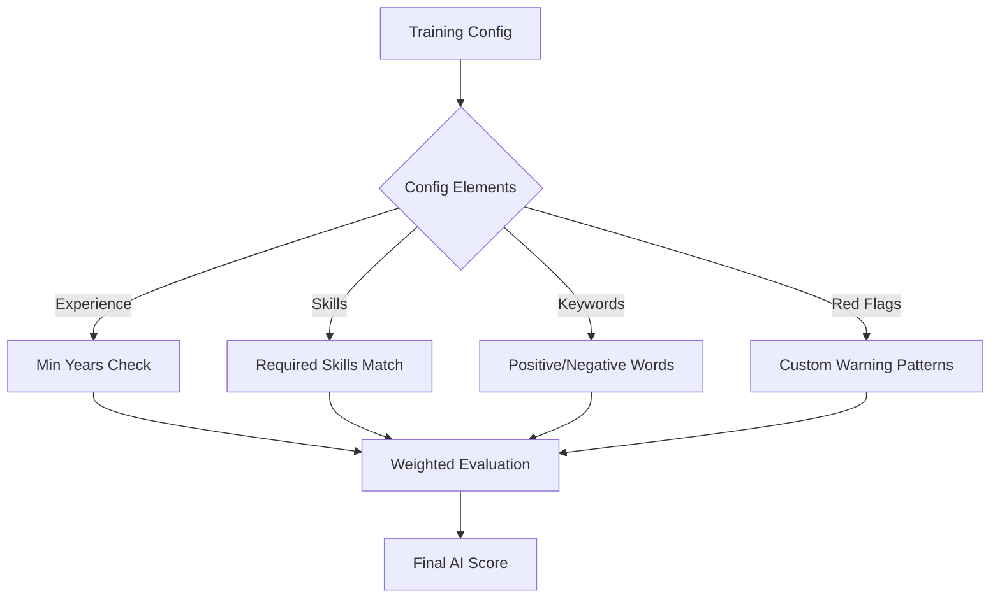
```mermaid
graph TD
    A[Training Config] --> B{Config Elements}
    B -->|Experience| C[Min Years Check]
    B -->|Skills| D[Required Skills Match]
    B -->|Keywords| E[Positive/Negative Words]
    B -->|Red Flags| F[Custom Warning Patterns]
    C --> G[Weighted Evaluation]
    D --> G
    E --> G
    F --> G
    G --> H[Final AI Score]
```

---

## Real-time Updates Flow

### Live Leaderboard
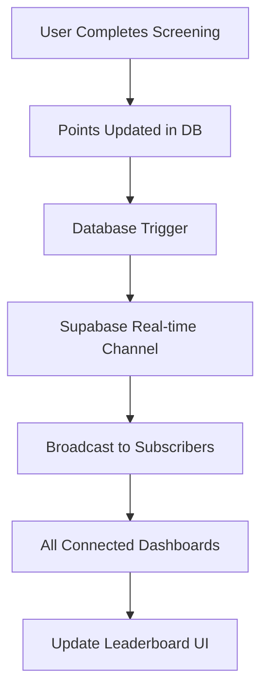
```mermaid
graph TD
    A[User Completes Screening] --> B[Points Updated in DB]
    B --> C[Database Trigger]
    C --> D[Supabase Real-time Channel]
    D --> E[Broadcast to Subscribers]
    E --> F[All Connected Dashboards]
    F --> G[Update Leaderboard UI]
```

### Progress Tracking
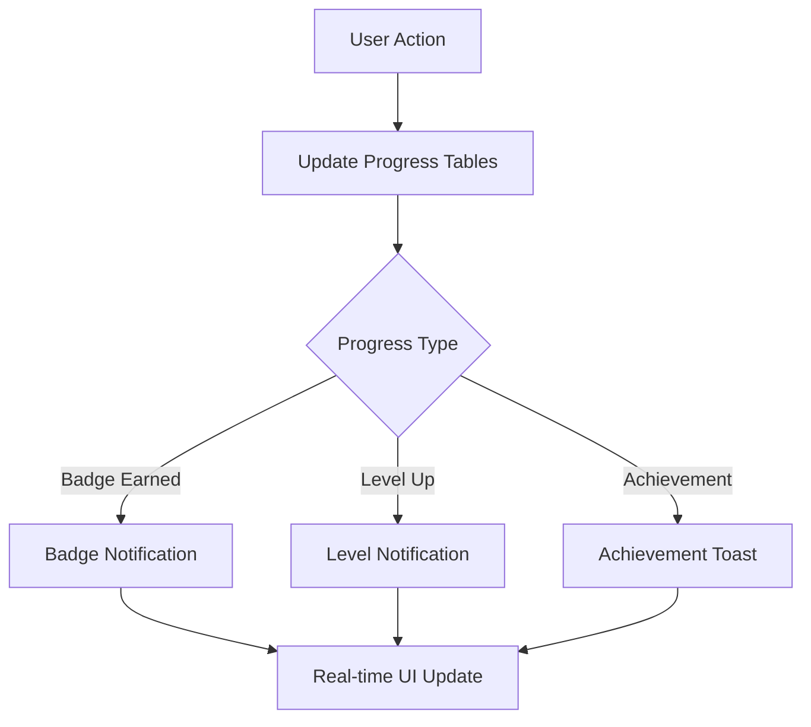
```mermaid
graph TD
    A[User Action] --> B[Update Progress Tables]
    B --> C{Progress Type}
    C -->|Badge Earned| D[Badge Notification]
    C -->|Level Up| E[Level Notification]
    C -->|Achievement| F[Achievement Toast]
    D --> G[Real-time UI Update]
    E --> G
    F --> G
```

### Challenge Mode
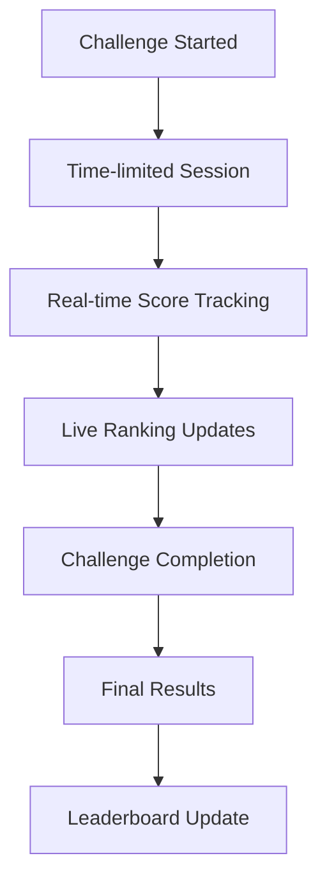
```mermaid
graph TD
    A[Challenge Started] --> B[Time-limited Session]
    B --> C[Real-time Score Tracking]
    C --> D[Live Ranking Updates]
    D --> E[Challenge Completion]
    E --> F[Final Results]
    F --> G[Leaderboard Update]
```

---

## Data Flow Architecture

### Component Data Flow
```
┌─────────────────┐    ┌─────────────────┐    ┌─────────────────┐
│   UI Components │    │   Custom Hooks  │    │   Supabase API  │
│                 │◄──►│                 │◄──►│                 │
│ - Dashboard     │    │ - useAuth       │    │ - Database      │
│ - Scorecard     │    │ - useToast      │    │ - Auth          │
│ - Leaderboard   │    │ - useMobile     │    │ - Storage       │
└─────────────────┘    └─────────────────┘    └─────────────────┘
```

### State Management
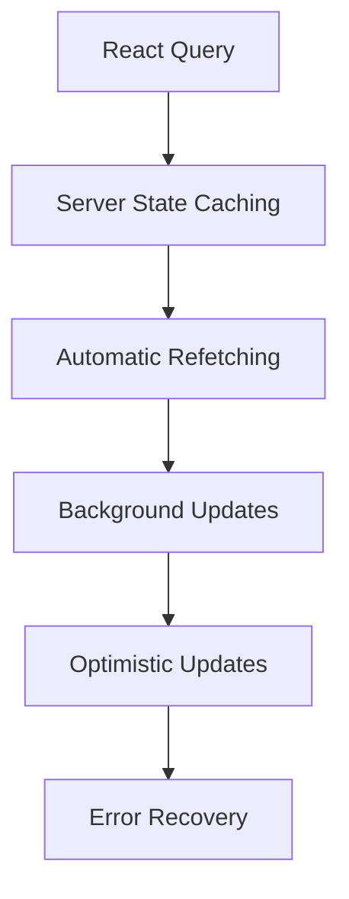
```mermaid
graph TD
    A[React Query] --> B[Server State Caching]
    B --> C[Automatic Refetching]
    C --> D[Background Updates]
    D --> E[Optimistic Updates]
    E --> F[Error Recovery]
```

---

## Security Flow

### Row Level Security (RLS)
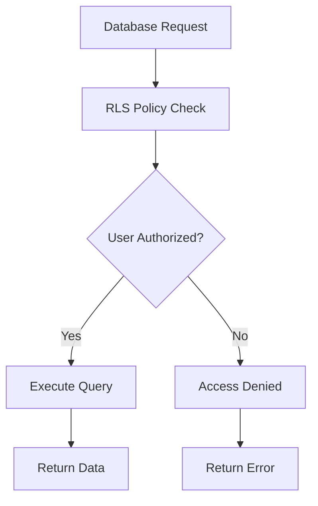
```mermaid
graph TD
    A[Database Request] --> B[RLS Policy Check]
    B --> C{User Authorized?}
    C -->|Yes| D[Execute Query]
    C -->|No| E[Access Denied]
    D --> F[Return Data]
    E --> G[Return Error]
```

### Admin Access Control
```mermaid
graph TD
    A[Admin Action] --> B[Check user_roles Table]
    B --> C{Has Admin Role?}
    C -->|Yes| D[Allow Admin Functions]
    C -->|No| E[Redirect to Login]
    D --> F[Full Admin Access]
    E --> G[Show Access Denied]
```

---

## Error Handling Flow

### Global Error Management
```mermaid
graph TD
    A[Error Occurs] --> B{Error Type}
    B -->|Network| C[Retry Logic]
    B -->|Auth| D[Redirect to Login]
    B -->|Validation| E[Form Error Display]
    B -->|Server| F[Toast Notification]
    C --> G[Background Retry]
    D --> H[Clear User State]
    E --> I[Highlight Fields]
    F --> J[User-friendly Message]
```

---

## Performance Optimization Flow

### Loading Strategies
```mermaid
graph TD
    A[Page Load] --> B[Critical Resources First]
    B --> C[Lazy Load Components]
    C --> D[Progressive Enhancement]
    D --> E[Background Data Fetching]
    E --> F[Cache Strategy]
```

### Caching Strategy
```
┌─────────────────┐    ┌─────────────────┐    ┌─────────────────┐
│   Browser Cache │    │   React Query   │    │   Supabase      │
│                 │◄──►│   Cache         │◄──►│   Cache         │
│ - Static Assets │    │ - API Responses │    │ - Query Results │
│ - Images        │    │ - User Data     │    │ - Real-time     │
└─────────────────┘    └─────────────────┘    └─────────────────┘
```

---

This documentation provides a comprehensive overview of all the major flows in the Siftera application. Each flow is designed to provide a smooth user experience while maintaining security, performance, and real-time capabilities.